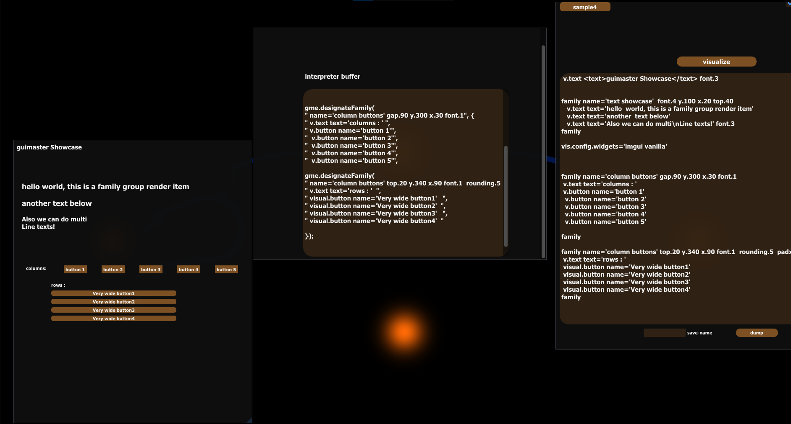

# Public-Guimaster-Library
Light-weight Graphics Library, module and a framework. Semi-open Source.

Cool features: 
-- Custom scripting language for C++.
-- Extensive WINAPI configs for cool overlays and modern UIs.
-- high level UI design
-- Minimal bloat and no dependency on GLFW
-- Runtime scripting editor
-- header only

```cpp
     // INTERPRETER LANGUAGE EXAMPLE
 
      gmElements gme;

      gme.designateFamily(" y.10 top.35", {
         "v.checkbox name='SomeCheckBox'", "v.input input.size='500' name='SomeInput'" 
      });
 

     if (gm.awaitEnabled("SomeCheckBox"))
           .....

  astr widget_input_buffer = gm.awaitInput("SomeInput");
  widget_input_buffer.print();

  // or here youd like to run through a group of buttons and wait for anyone to be interacted with ( requires visuals to be registered with a group )
  if (astr pressed_Button_name = gm.any_pressed_in_group("store"))  
           .....     
   
```                                   
                                        
                                        
                                        
                                        
                                        
                  
                                                                   
> 

   
